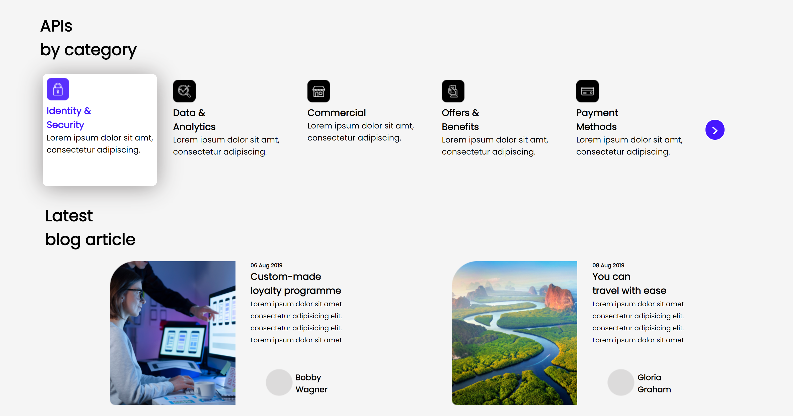
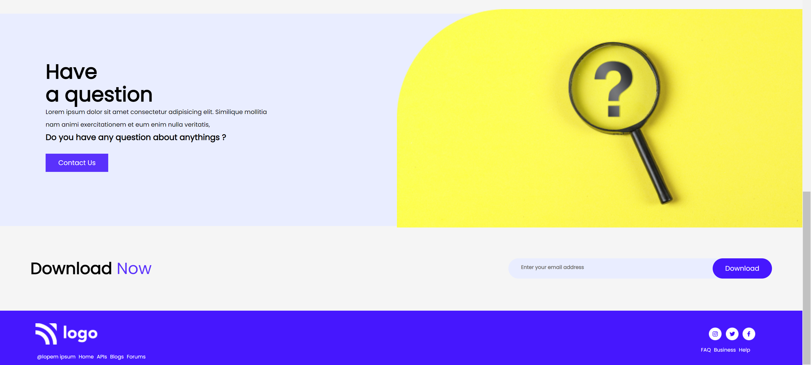

# This project Built With
#### 1.HTML
#### 2.CSS

## Acknowledgements
This landing page, took me almost 2days to complete,this is my project09 in fullstack development course by ineuron.in.

### During this project I've learned:

1.How to write html and css in parell.
2.How to use float and flex properties.
3.How to make two divs close to each other.
4.How to postion element using CSS position properties.

## Here is screen shot of project09.

## Here is live link
[Live link]()